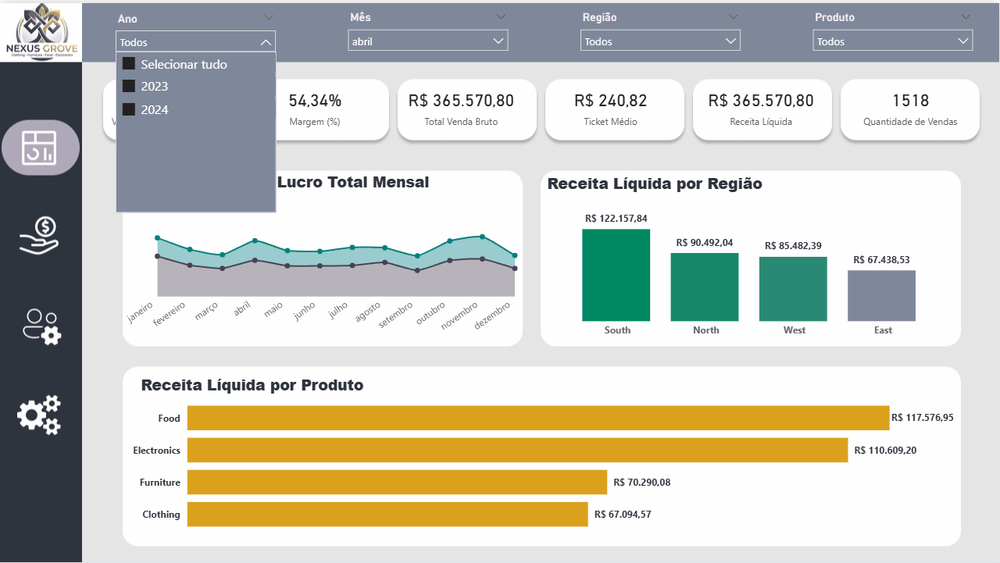
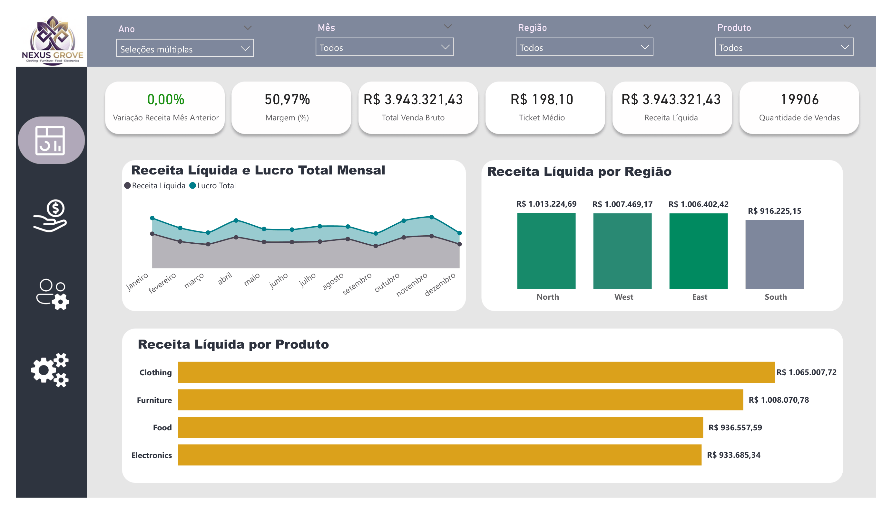
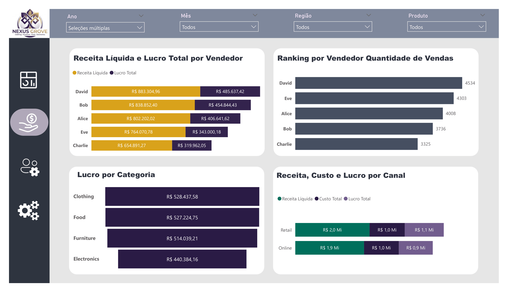
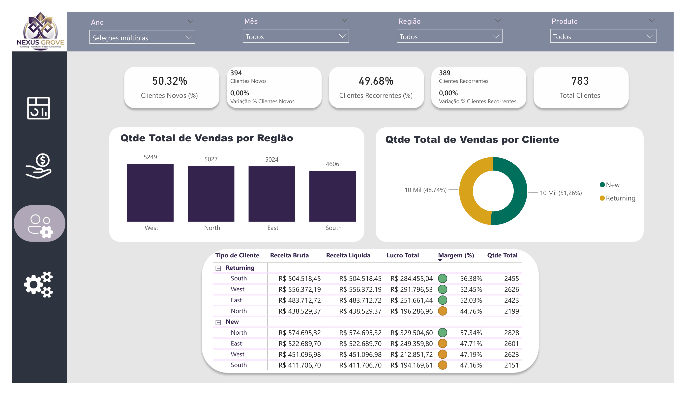
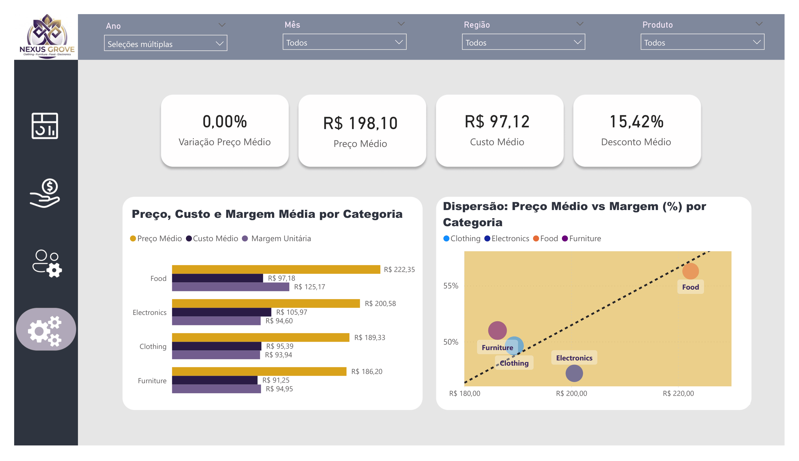

# Análise de Vendas | Power BI

## Sobre o Projeto
Este projeto tem como objetivo analisar o desempenho comercial da empresa fictícia **Nexus Grove**, transformando dados brutos em insights estratégicos para tomada de decisão.

Através do Power BI, foi desenvolvido um dashboard interativo capaz de responder perguntas-chave do negócio, como:
- A operação está financeiramente saudável?
- Quais vendedores e canais geram mais resultado?
- O crescimento está equilibrado entre novos e recorrentes?
- Onde estão as oportunidades de melhoria de margem?

---

## Principais Insights
- A empresa apresenta uma **margem saudável de 50,97%**, indicando boa eficiência operacional.
- Existe um **equilíbrio entre clientes novos (50,32%) e recorrentes (49,68%)**, garantindo sustentabilidade da receita.
- O vendedor **David** lidera em performance, sendo referência em volume e faturamento.
- O canal **Retail** apresenta leve vantagem sobre o Online em receita total.
- Categorias com maior valor agregado apresentam melhor rentabilidade.

---

## Dataset
Os dados representam transações de vendas no varejo.

- 📅 Período: 01/01/2023 a 01/01/2024  
- 📦 Volume: 783 registros  

**Tabelas:**
- `vendas.csv` → Base principal com transações  
- `Medidas` → 23 medidas DAX  
- `dCalendario` → Dimensão temporal  

---

## ETL e Modelagem
Transformações realizadas no Power Query e modelagem no Power BI:

- Padronização de dados (moeda e percentual)
- Estruturação em **Star Schema**
- Tratamento de descontos para cálculo de receita líquida
- Criação de métricas de tempo (MoM)

---

## Métricas Principais

| Métrica | Valor |
|--------|------|
| Receita Líquida | R$ 3,94 Mi |
| Lucro Total | R$ 2,01 Mi |
| Margem (%) | 50,97% |
| Ticket Médio | R$ 198,10 |
| Total de Clientes | 783 |

---

## Visualizações

### Visão Executiva
KPIs principais e evolução mensal  
Destaque: Região North com maior faturamento  

### Performance Comercial
- Ranking de vendedores  
- Comparação entre canais (Retail vs Online)  

### Análise de Clientes
- Distribuição entre novos e recorrentes  
- Volume de vendas por perfil de cliente  

### Eficiência e Rentabilidade
- Relação entre preço médio e margem  
- Destaque para categorias mais lucrativas  

---

## Conclusão
A análise demonstra que a Nexus Grove possui uma operação sólida e equilibrada, com boa gestão de custos e crescimento sustentável.

No entanto, os dados revelam oportunidades estratégicas importantes:
- Otimizar margens em vendas de alto volume  
- Reduzir impacto de descontos  
- Incentivar produtos com maior valor agregado  

Em resumo:  
O negócio está saudável, mas pode evoluir com decisões mais orientadas à **rentabilidade e eficiência comercial**.

---

## Ferramentas Utilizadas
- Power BI  
- Power Query  
- DAX  
- Modelagem de Dados  

---

## Como Executar
1. Instale o Power BI Desktop  
2. Clone o repositório:
```bash
git clone https://github.com/rafaelarochf/analise-vendas-powerbi
```
## Demonstração do Dashboard



---

##  Screenshots do Dashboard







---
*Projeto desenvolvido por **Rafaela Freitas** para portfólio de Análise de Dados.*