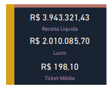

# Projeto 01 – Análise de Vendas (Power BI)

##  Objetivo do Projeto

Analisar dados de vendas para entender o desempenho comercial da empresa, identificar padrões de compra, avaliar a performance de vendedores e analisar o comportamento de vendas por região, produto e canal.

O projeto busca responder perguntas estratégicas como:
- “A operação está saudável?”
- “Quem realmente gera resultado?”
- “Estamos crescendo com qualidade ou só volume?”
- “Onde estamos ganhando ou perdendo margem?”

---

##  Ferramentas Utilizadas

- **Power BI** (Visualização e Storytelling)
- **Excel** (Fonte de dados)
- **Power Query** (ETL - Tratamento de dados)
- **DAX** (Criação de métricas personalizadas)
- **Figma** (Design de Background)

---

##  Dataset

Base de dados fictícia contendo informações de vendas: produtos, vendedores, regiões, clientes e métodos de pagamento.

### Principais Colunas:
- `Product_ID`: Identificador do produto vendido
- `Sale_Date`: Data da venda
- `Sales_Rep`: Vendedor responsável
- `Region`: Região da venda
- `Sales_Amount`: Valor total da venda
- `Product_Category`: Categoria do produto
- `Customer_Type`: Tipo de cliente (Novo ou Recorrente)
- `Discount`: Percentual de desconto aplicado
- `Sales_Channel`: Canal de venda (Online ou Loja Física)

---

##  Estrutura do Dashboard

### 1. Visão Executiva (Executive Summary)
**Objetivo:** Resposta rápida sobre a saúde da operação.
- **Visualizações:** Cards de Receita Líquida, Custo, Lucro, Margem e Qtd Total com indicadores de variação (MoM). Gráfico de linha temporal e barras por região.
- **Insight:** Identificação de tendências de crescimento e sazonalidade da receita e do lucro.

### 2. Performance Comercial
**Objetivo:** Identificar quem realmente traz resultado financeiro.
- **Visualizações:** Ranking de vendedores por receita vs. lucro e análise de canais de venda.
- **Diferencial:** Inclusão de **Tooltips personalizados** que mostram a Margem (%) ao passar o mouse sobre cada vendedor.

### 3. Análise de Clientes
**Objetivo:** Avaliar o equilíbrio entre aquisição e retenção.
- **Visualizações:** Proporção de clientes Novos vs. Recorrentes e distribuição geográfica da base.
- **Insight:** Análise da estabilidade e previsibilidade de receita através da taxa de recorrência.

### 4. Eficiência e Rentabilidade
**Objetivo:** Identificar oportunidades de ganho de margem.
- **Visualizações:** Análise de dispersão cruzando Preço Médio vs. Margem (%) e composição de custo por categoria.
- **Insight:** Descoberta de produtos/categorias que possuem alto preço mas margens baixas, sinalizando necessidade de revisão de custos.

---

##  Insights Gerais

* **Regiões:** Identificação dos polos de maior volume de vendas.
* **Vendedores:** Distinção entre vendedores de volume e vendedores de margem (eficiência).
* **Produtos:** Mapeamento das categorias mais lucrativas para a operação.
* **Clientes:** Equilíbrio estratégico entre a entrada de novos clientes e a fidelização da base.

---

##  Screenshots do Dashboard

### Visão Geral

### Performance Comercial

### Análise de Clientes

### Eficiência e Rentabilidade

### Tooltip em Ação

---
 *Projeto desenvolvido por Rafaela como parte do portfólio de formação em Análise de Dados.*