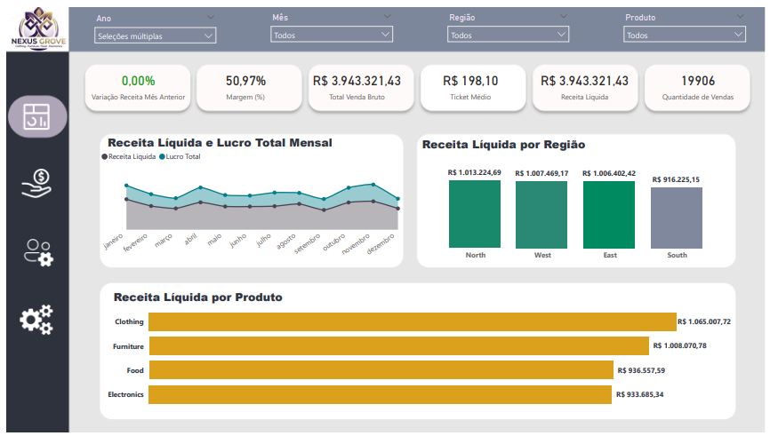
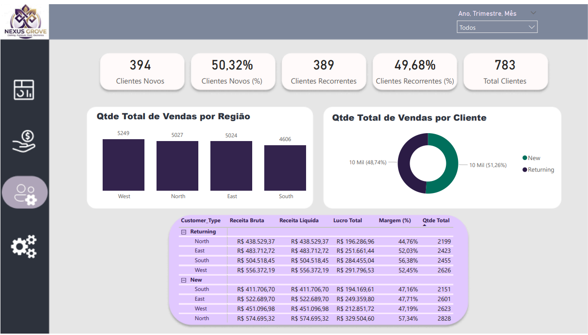
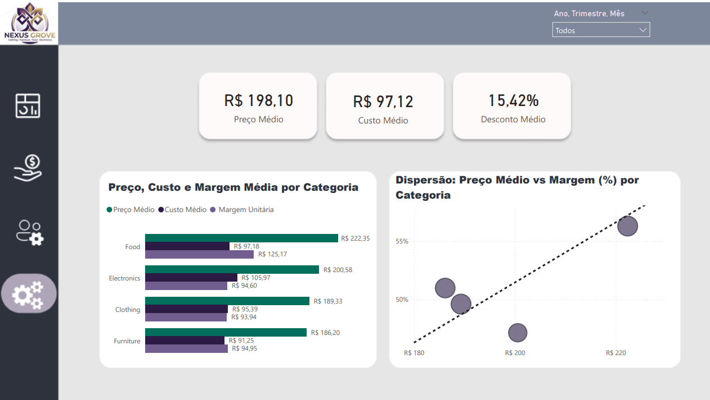

# Projeto 01 – Análise de Vendas (Power BI)

## 1️⃣ Objetivo do Projeto
Este dashboard foi desenvolvido para analisar o desempenho comercial da empresa fictícia Nexus Grove, permitindo uma visão clara sobre a saúde financeira da operação. Ele responde perguntas estratégicas para a tomada de decisão:
- **A operação está saudável?** Monitoramento de Receita Líquida (R$ 3,94 Mi) vs. Lucro Total (R$ 2,01 Mi).
- **Quem realmente gera resultado?** Performance detalhada por vendedor (liderada por David) e canal de venda.
- **Estamos crescendo com qualidade?** Equilíbrio entre a aquisição de Clientes Novos (50,32%) e a retenção de Recorrentes (49,68%).
- **Onde ganhamos ou perdemos margem?** Análise de eficiência de preço, custo e descontos por categoria.

---

## 2️⃣ Dataset
Os dados consistem em uma base de transações estruturada para análise de performance em varejo.
- **Período:** 01/01/2023 a 01/01/2024.
- **Volume:** 783 registros.

| Fonte de Dados | Descrição |
| :--- | :--- |
| **vendas.csv** | Tabela fato com transações, IDs de produtos, vendedores e registros financeiros. |
| **Medidas** | Tabela contendo 23 medidas DAX para cálculos de performance e crescimento. |
| **dCalendario** | Dimensão de tempo para análise de série temporal e inteligência de dados. |

---

## 3️⃣ Limpeza e Transformação de Dados (ETL)
Processo realizado no **Power Query** e modelagem de dados:
- **Padronização:** Tipos de dados ajustados para Moeda e Percentual em todas as métricas financeiras.
- **Modelagem Star Schema:** Relacionamento entre tabelas de dimensões e a tabela fato para otimização de filtros.
- **Cálculo de Descontos:** Tratamento da coluna de descontos (Média de 15,42%) para obtenção da Receita Líquida real.
- **Inteligência de Tempo:** Implementação de cálculos MoM (Month-over-Month) para monitorar variações mensais.

---

## 4️⃣ Métricas e DAX (Principais Destaques)
As métricas fundamentais para a gestão do negócio extraídas do modelo:

| Medida | Valor/Descrição | Objetivo |
| :--- | :--- | :--- |
| **Receita Líquida** | `R$ 3.943.321,43` | Faturamento real disponível após descontos aplicados. |
| **Lucro Total** | `R$ 2.010.085,70` | Resultado final da operação após dedução de custos. |
| **Margem (%)** | `50,97%` | Eficiência percentual de rentabilidade da empresa. |
| **Ticket Médio** | `R$ 198,10` | Valor médio gasto por venda no período analisado. |
| **Total Clientes** | `783` | Base total dividida entre 394 novos e 389 recorrentes. |

---

## 5️⃣ Visualizações e Insights

###  Visão Executiva
Apresenta os KPIs principais e a evolução mensal. A Receita Líquida por Região destaca o **North** (R$ 1,01 Mi) como a área de maior faturamento.

###  Performance Comercial
Ranking de vendedores onde **David** lidera em Receita Líquida (R$ 883 mil) e em volume de vendas (4.534). 
- **Canais:** O canal **Retail** (R$ 2,0 Mi) supera ligeiramente o **Online** (R$ 1,9 Mi) em receita total.

###  Análise de Clientes
Equilíbrio estratégico entre tipos de clientes. O volume total de vendas é maior em clientes **Novos** (51,26%) em comparação aos **Recorrentes** (48,74%).

###  Eficiência e Rentabilidade
Análise de dispersão entre Preço Médio e Margem %.
- **Destaque:** A categoria **Food** possui o maior Preço Médio (R$ 222,35) e a melhor Margem Unitária (R$ 125,17).

---

## 6️⃣ Conclusão / Takeaways
- **Rentabilidade:** A categoria **Clothing** gera o maior Lucro Total por Categoria (R$ 528.437,58).
- **Estratégia:** Manter a taxa de recorrência próxima a 50% é vital para a previsibilidade de receita da Nexus Grove.
- **Oportunidade:** Vendedores com alto volume, mas margens inferiores, representam oportunidade de treinamento focado em produtos Premium.

---

## 7️⃣ Como Abrir o Dashboard
1. Instale o [Power BI Desktop](https://powerbi.microsoft.com/desktop/).
2. Clone o repositório: `git clone https://github.com/rafaelarochf/analise-vendas-powerbi`
3. Abra o arquivo `.pbix` na pasta `dashboard`.
4. Utilize os filtros de **Ano, Mês, Região e Produto** para interações dinâmicas.

---

##  Screenshots do Dashboard

---
📌 *Projeto desenvolvido por **Rafaela Freitas** para portfólio de Análise de Dados.*